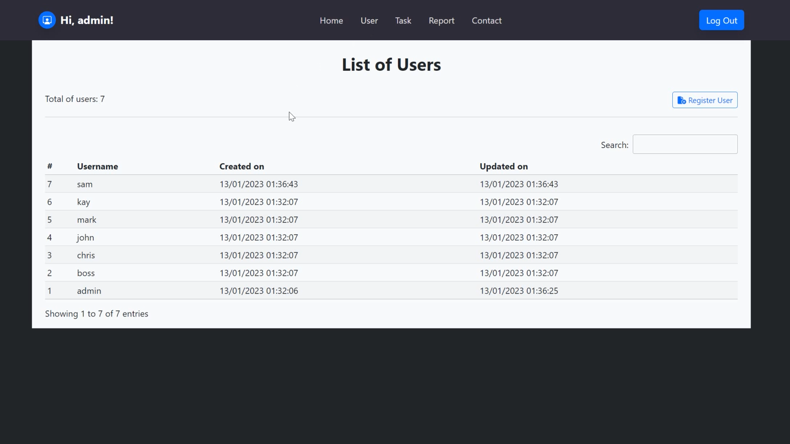

## Capstone Project 3 - Task Manager (Django) 
<a href="https://6gg9.short.gy/jRMugp" target="_blank">:arrow_right: Preview</a>  

### Introduction 

This task management application was built using the **Django framework**. It allows users to log in, register new users, add tasks, and view a list of tasks. and generate reports on tasks. It also includes a feature that displays a random quote from Zen on the homepage.


<p align="center">
  
<br>
<i>3.1 The overview of Task Manager</i></p>


<video src='capstone_project/assets/video/preview.mp4' />


   


### Getting Started

These instructions will get you a copy of the project up and running on your local machine for development and testing purposes.

####  Prerequisites

- **Python** 3.10 or later
- **Django** 4.1 or later
- Additional packages: django-session-timeout, requests, pytz


#### Installation

I recommend you follow <a href="https://docs.djangoproject.com/en/4.1/intro/tutorial01/">Django's tutorial</a> to start your project and application first and then take my repository as your reference.

1. **Install** Python, Django and the required packages on your local machine. Follow the introductions to install <Python href="https://www.python.org/" target="_blank">Python</a>

```
pip install django
pip install django-session-timeout
pip install requests
pip install pytz
```
2. **Create** a Django project

```
django-admin startproject capstone_project
```

3. **Start** a development server to see the Django function properly

```
python manage.py runserver
```

4. **Create** an application **task_manager**
```
python manage.py startapp task_manager
```

5. **Apply** the migrations to build up models
```
python manage.py makemigrations
python manage.py migrate
```

6.  **Clone** the repository for your reference
```
git clone https://github.com/cwchan0212/hyperiondev-capstone3-django.git
```

7. **Navigate** to the project directory and copy the files according to the following file structures. Take a reference to **my settings_sample.py** for your **settings.py** and rename **views_sample.py** to **views.py**.
```
cd capstone_project
```

> Note: The issue of **static** directory is solved in my **setting_sample.py**.

### File Structure
```
capstone_project/
├─ capstone_project/
│  ├─ asgi.py
│  ├─ settings.py *
│  ├─ urls.py
│  ├─ wsgi.py
│  ├─ __init__.py
├─ task_manager/
│  ├─ migrations/
│  ├─ static/
│  │  ├─ css/
│  │  │  ├─ Banner-Heading-Image-images.css
│  │  │  ├─ bootstrap.min.css
│  │  │  ├─ style.css
│  │  ├─ images/
│  │  │  ├─ cat.png
│  │  │  ├─ favicon.ico
│  │  │  ├─ notebook.png
│  │  │  ├─ pixel.png
│  │  ├─ js/
│  │  │  ├─ bold-and-dark.js
│  │  │  ├─ bootstrap.min.js
│  │  │  ├─ bs-init.js
│  │  │  ├─ script.js
│  ├─ templates/
│  │  ├─ report/
│  │  │  ├─ index.html
│  │  │  ├─ print.html
│  │  ├─ task/
│  │  │  ├─ form.html
│  │  │  ├─ index.html
│  │  ├─ user/
│  │  │  ├─ form.html
│  │  │  ├─ index.html
│  │  ├─ base.html
│  │  ├─ home.html
│  │  ├─ login.html
│  ├─ templatetags/
│  │  ├─ task_manager_tags.py
│  │  ├─ __init__.py
│  ├─ admin.py
│  ├─ apps.py
│  ├─ data.py
│  ├─ models.py
│  ├─ tests.py
│  ├─ urls.py
│  ├─ views.py *
│  ├─ __init__.py
├─ db.sqlite3
├─ manage.py
```

> Note: *I rename the **views.py** and **settings.py** to **views_sample.py** and **settings.py_sample** for your reference. I remove the unused views and route from views.py. As for settings.py, it is different from the Django server. Once you start your project, it will generate a **Secret Key** into the settings.py. Please keep it **secret**. 

### Model

#### TaskUser
The **TaskUser** model has several fields: 
* user_id as primary key
* user_username
* user_password (hashed protected),
* user_created_date
* user_updated_date
* user_deleted

The **user_id** field is set as the **primary key**, which means that it is unique for each user and will be used as the identifier for the user. The user_password field is **hashed** for the protection of sensitive information.

#### Task
The Task model also has several fields: 
* task_id as primary key
* task_title
* task_description
* task_assign_date
* task_due_date
* task_deleted
 
The **task_id** field is set as the **primary key**, which means that it is unique for each task. It also has a **foreign key** called **user_id**, which is a reference to the user_id primary key field in the TaskUser model. This establishes a one-to-many relationship between the TaskUser and Task models, as one user can have multiple tasks.


### Usage

1. Start the development server:
2. Open a web browser and navigate to `http://127.0.0.1:8000/`
3. Register a new user or log in as an existing user
4. Add, view, and edit tasks
5. Generate user and task overview reports from the homepage
6. Features
   - User: Register user (admin only)
   - Task: Add task, edit task
   - Report: Generate a report (admin only)
   - Quote: Generate random quotations

#### Login

The user is required to enter a **username** and **password**. If the user enters an invalid username or password, an error message will be displayed and the user will be prompted to try again.

<p align="center"><br>
<i>3.2 Login screen</i></p>

> Note: The test accounts are used for testing purposes

#### User

After the user logs in successfully, he can access the User section and list the users.

<p align="center"><br>
<i>3.3 List of Users</i></p>

Only the user with the username **admin is allowed to register new users**. The user will be prompted to enter a new username and password. The user will also be asked to confirm the password. If the value entered to confirm the password matches the value of the password, the username and password will be stored in the **TaskUser** table.

<p align="center"><br>
<i>3.4 Register User</i></p>

<p align="center"><br>
<i>3.5 Register User* screen</i></p>

<p align="center"><br>
<i>3.6 A new user is registered successfully</i></p>

#### Task

The user can also access the **Task** section to perform the functions of **adding and editing tasks**.

<p align="center"><br>
<i>3.7 List of tasks</i></p>

<p align="center"><br>
<i>3.8 List of tasks (View Mine)</i></p>

<p align="center"><br>
<i>3.9 List of tasks (View All)</i></p>

The user selects the username of the **person** the task is **assigned** to and enters the **title** of the task, a **description** of the task, and the **due date** of the task. The task will be added to the **Task** table.

<p align="center"><br>
<i>3.10 Add Task</i></p>

<p align="center"><br>
<i>3.11 Add Task screen</i></p>
    
<p align="center"><br>
<i>3.12 A new task is added successfully</i></p>

The user can choose **edit task** or **mark the task as complete**. 

##### Edit Task

<p align="center"><br>
<i>3.13 **Edit Task** button</i></p>

<p align="center"><br>
<i>3.14 Edit Task screen</i></p>

<p align="center"><br>
<i>3.15 The task is updated successfully.</i></p>

##### Mark Complete

<p align="center"><br>
<i>3.16 Mark Complete button</i></p>

<p align="center"><br>
<i>3.17 The task is marked as complete successfully</i></p>

**Points to note**

* The user can edit their assigned tasks at any time, but once a task is **marked as complete**, it can **no longer be edited**. 
* The task can **only be edited** if it has **not yet** been **completed**. 
* The user can view all tasks created by other users, but can **only edit their own assigned tasks**.

#### Report

In the **Report** section, the username **admin** can view the **statistics** of user overview and task overview, as well as print these **reports**.

<p align="center"><br>
<i>3.18 The statistics of user overview and task overview are shown on Task Manager Report</i></p>

<p align="center"><br>
<i>3.19 Printable version of Task Manager Report* </i></p>

> Note: The "Report" section will be displayed only for the admin user.

<p align="center"><br>
<i>3.20 The "Report" section is not shown as the general users log in.</i></p>

<p align="center"><br>
<i>3.21 The "Register User" button is not shown as the general users log in.</i></p>

#### Quote

When the user clicks the **Hey** button, it generates a new quote on the homepage of **Task Manager**

<p align="center"><br>
<i>3.22 The default message on the homepage of Task Manager</i></p>

<p align="center"><br>
<i>3.23 The quote is generated after clicking the "Hey" button</i></p>

### Known Issue

> Mixed Content: The page at '<URL>' was loaded over HTTPS, but requested an insecure XMLHttpRequest endpoint '<URL>'. This request has been blocked; the content must be served over HTTPS.

Error "**Mixed Content**: The page at '<URL>' was loaded over HTTPS, but requested an insecure XMLHttpRequest endpoint '<URL>'. This request has been blocked; the content must be served over HTTPS." when trying to obtain quotes from <a href="https://type.fit/api/quotes" target="_blank">https://type.fit/api/quotes</a>


### Solution

To solve this issue, a **Content-Security-Policy** meta tag is added in the **head** of the HTML file. This meta tag tells the browser to **upgrade insecure requests**.

```html
<meta http-equiv="Content-Security-Policy" content="upgrade-insecure-requests">
```
Please make sure to include this **meta** tag in the head of your HTML file to prevent the issue from occurring.

### Built With

- <a href="https://www.djangoproject.com" target="_blank">Django</a> - The web framework used
- <a href="https://www.python.org" target="_blank">Python</a> - Programming Language
- <a href="https://www.sqlite.org" target="_blank">SQLite</a> - Database
- Followed **MVT** Architecture


### Acknowledgments
This project was inspired by <a href="https://www.hyperiondev.com" target="_blank">HyperionDev</a>.